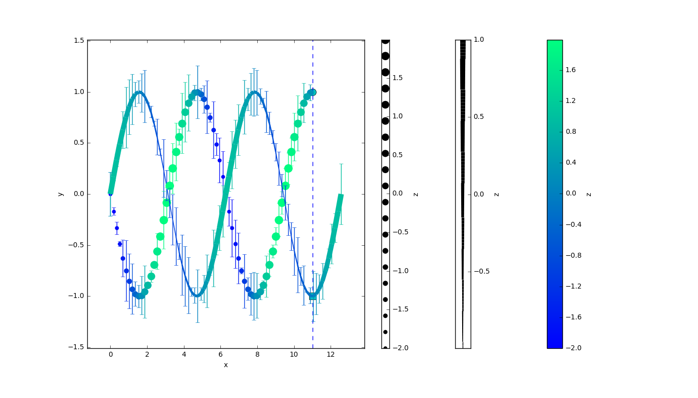

# autofig

autofig is a work-in-progress, and is not yet stable.

This module provides a high-level interface to create figures/animations (currently only in matplotlib).  It was designed to be used within [PHOEBE](http://github.com/phoebe-project/phoebe2).

**NOTE:** autofig is still a work in progress and so the API may change at any time.

autofig aims to provide the following:
* a unified calling structure to matplotlib's [plot](http://matplotlib.org/api/_as_gen/matplotlib.axes.Axes.plot.html), [scatter](http://matplotlib.org/api/_as_gen/matplotlib.axes.Axes.scatter.html), [errorbar](http://matplotlib.org/api/_as_gen/matplotlib.axes.Axes.errorbar.html), [LineCollection](http://matplotlib.org/gallery/shapes_and_collections/line_collection.html), and [PolyCollection](http://matplotlib.org/api/collections_api.html#matplotlib.collections.PolyCollection) in both 2D and 3D projections.  So if you decide you want to add errorbars or colorscaling to an existing plot call, you don't need to change the entire calling structure anymore.
* basic "3D" support within 2D figures (by providing the z-coordinate, the z-orders will automatically be set)
* a high-level wrapper to animate an existing plot over some independent-variable (i.e. time), with effects including highlight and uncover.
* intelligent options for axes limits within animations.
* intelligent defaults for subplot creation based on conflicts in units/labels.

In general, autofig attempts to provide smart defaults with a high-level interface while still providing full customization with access to the underlying matplotlib objects.

## Dependencies

* [matplotlib](https://github.com/matplotlib/matplotlib)
* [numpy](https://github.com/numpy/numpy)
* [astropy](https://github.com/astropy/astropy)

See the [travis report](https://travis-ci.org/kecnry/autofig) for details on the full testing-matrix.

## Installation

Installation is done using the standard python setup.py commands.

To install globally:
```
python setup.py build
sudo python setup.py install
```

Or to install locally:
```
python setup.py build
python setup.py install --user
```

## Basic Usage

autofig is imported as a python module:

```
import autofig
```

For more details, see the example scripts in the examples directory or the following tutorials:
* [autofig basics](examples/autofig_basics.ipynb)
* [autofig limits](examples/autofig_limits.ipynb)
* [autofig size modes](examples/autofig_size_modes.ipynb)
* [autofig meshes](examples/autofig_mesh.ipynb)
* [autofig objects](examples/autofig_objects.ipynb)

## Gallery

(click on any of the images below to view the ipynb notebook that created that figure)

[](examples/autofig_megaexample.ipynb)

## How it works

autofig builds up objects for the Figure, Axes, and individual plotting Calls (currently Plot or Mesh).  These then handle high-level functionality such as axes limits and subplot placement.

## Contributing

Contributions are welcome!  Feel free to file an issue or fork and create a pull-request.
