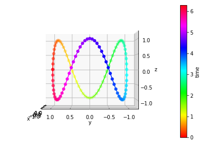
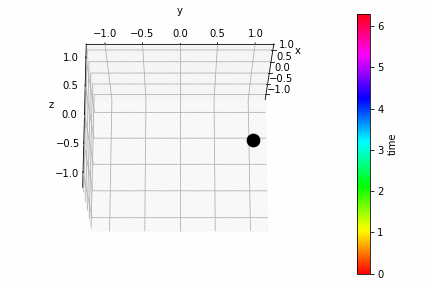

# Gallery: 3D animation


```python
import autofig
import numpy as np
```


```python
#autofig.inline()
```


```python
t = np.linspace(0, 2*np.pi, 101)
x = np.sin(t)
y = np.cos(t)
z = np.sin(3*t)
```


```python
autofig.reset()
autofig.plot(x, y, z, i=t, c=t, cmap='hsv',
             xlabel='x', ylabel='y', zlabel='z', clabel='time',
             s=0.02,
             projection='3d', azim=[0, 360], elev=[-20,20],
             uncover=True)
mplfig = autofig.draw()
```





```python
autofig.gcf().axes[0].z.get_lim(i=0)
```


    (-1.2, 1.2)


```python
anim = autofig.animate(i=t, 
                       save='3d_animation.gif', save_kwargs={'writer': 'imagemagick'})
```




```python

```
