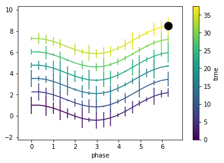
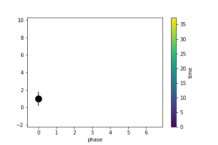

# Gallery: Looping Independent Variable


```python
import autofig
import numpy as np
```


```python
order = [1,4,3,5,2,6]
t = np.concatenate([np.linspace((i-1)*2*np.pi, i*2*np.pi, 20, endpoint=False) for i in order])
x = np.concatenate([np.linspace(0, 2*np.pi, 20) for i in order])
y = np.cos(x)+t/5
yerror = np.random.random(len(y))
```


```python
autofig.reset()
autofig.plot(x, y, yerror=yerror, i=t, c=t, 
             xlabel='phase', clabel='time',
             marker='None', uncover=True, linebreak='x-')

anim = autofig.animate(i=sorted(t), 
                       save='looping_indep.gif', save_kwargs={'writer': 'imagemagick'})
```








```python

```
