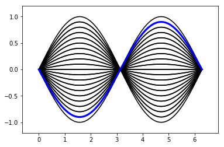
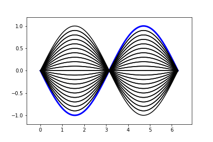
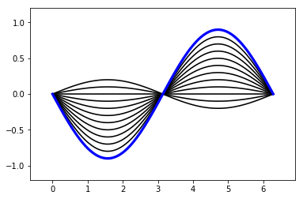
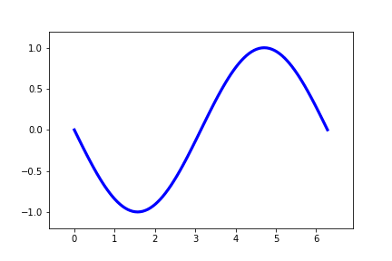
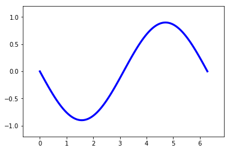

# Gallery: Selecting on Independent Variable


```python
import autofig
import numpy as np
```


```python
ampls = np.linspace(-1,1,21)
ampls = np.append(ampls, ampls[::-1][1:-1])
ts = np.arange(len(ampls))
x = np.linspace(0,2*np.pi,101)
ys = [ampl*np.sin(x) for ampl in ampls]
```


```python
autofig.reset()
for t,y in zip(ts,ys):
    autofig.plot(x, y, i=t, 
                 marker='none', linestyle='solid', c='black',
                 highlight_marker='None', highlight_linestyle='solid', highlight_color='blue')
    
mplanim = autofig.animate(i=ts,
                          save='selecting_indep_1.gif', save_kwargs={'writer': 'imagemagick'})
```








```python
autofig.reset()
for t,y in zip(ts,ys):
    autofig.plot(x, y, i=t, 
                 marker='none', linestyle='solid', c='black',
                 highlight_marker='None', highlight_linestyle='solid', highlight_color='blue',
                 uncover=True, trail=0.3)
    
mplanim = autofig.animate(i=ts,
                          save='selecting_indep_2.gif', save_kwargs={'writer': 'imagemagick'})
```








```python
autofig.reset()
for t,y in zip(ts,ys):
    autofig.plot(x, y, i=t, 
                 marker='none', linestyle='solid', c='black',
                 highlight_marker='None', highlight_linestyle='solid', highlight_color='blue',
                 uncover=True, trail=0)
    
mplanim = autofig.animate(i=ts,
                          save='selecting_indep_3.gif', save_kwargs={'writer': 'imagemagick'})
```





```python

```
