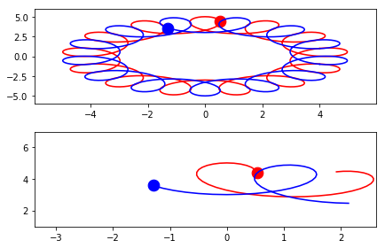

# Gallery: Sliding Limits


```python
import autofig
import numpy as np
```


```python
#autofig.inline()
```


```python
t = np.linspace(0, 24*np.pi, 401)

x1 = np.sin(t) + 4 * np.cos(t/12)
y1 = np.cos(t) + 4 * np.sin(t/12)

x2 = -np.sin(t) + 4 * np.cos(t/12)
y2 = -np.cos(t) + 4 * np.sin(t/12)
```


```python
style = {'marker': 'none', 'linestyle': 'solid'}

autofig.reset()

# on the first set of axes we'll show the whole view, with just highlight enabled
autofig.plot(x1, y1, i=t, color='r', **style)
autofig.plot(x2, y2, i=t, color='b', **style)

# on the second set of axes, we'll use sliding limits with uncover and trail enabled
autofig.add_axes()
autofig.plot(x1, y1, i=t, color='r', uncover=True, trail=0.1, **style)
autofig.plot(x2, y2, i=t, color='b', uncover=True, trail=0.1, **style)
autofig.gcf().axes[1].x.lim = 6
autofig.gcf().axes[1].y.lim = 6

mplfig = autofig.draw(i=20)
```





```python
anim = autofig.animate(i=t,
                       save='spiral_sliding_limits.gif', save_kwargs={'writer': 'imagemagick'})
```


```python

```
