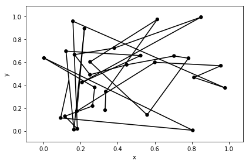
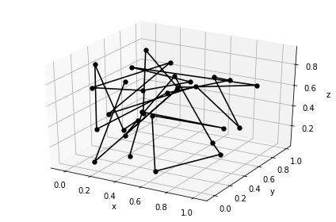
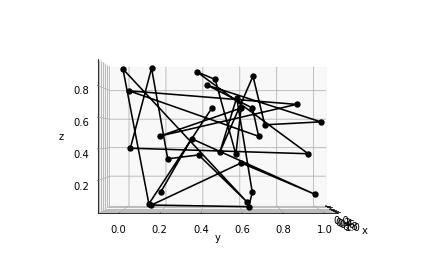
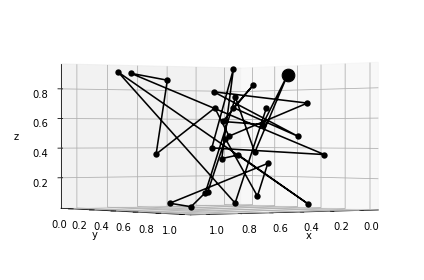
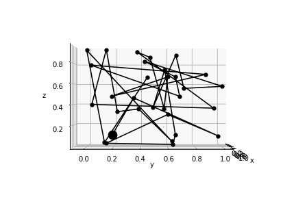
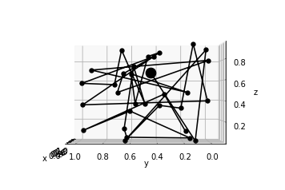
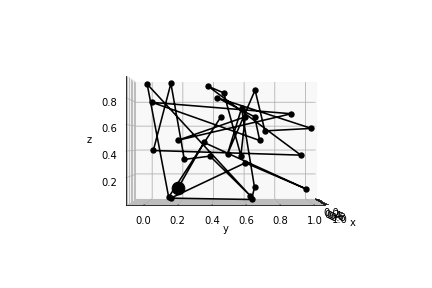

# Plotting in 3D with autofig


```python
import autofig
import numpy as np
```


```python
#autofig.inline()
```


```python
t = np.linspace(0,10,31)
x = np.random.rand(31)
y = np.random.rand(31)
z = np.random.rand(31)
```

By default, autofig uses the z dimension just to assign z-order (so that positive z appears "on top")


```python
autofig.reset()
autofig.plot(x, y, z, i=t,
             xlabel='x', ylabel='y', zlabel='z')
mplfig = autofig.draw()
```





To instead plot using a projected 3d axes, simply pass projection='3d'


```python
autofig.reset()
autofig.plot(x, y, z, i=t, 
             xlabel='x', ylabel='y', zlabel='z',
             projection='3d')
mplfig = autofig.draw()
```





If the projection is set to 3d, you can also set the elevation ('elev') and azimuth ('azim') of the viewing angle.  These are provided in *degrees* and can be either a float (fixed) or a list (changes as a function of the current value of i).


```python
autofig.reset()
autofig.plot(x, y, z, i=t, 
             xlabel='x', ylabel='y', zlabel='z',
             projection='3d', elev=0, azim=0)
mplfig = autofig.draw()
```





When provided as an array, the set viewing angle is determined as follows:

* if no i is passed, the median values of 'elev' and 'azim' are used
* if i is passed, then linear interpolation is used across the i dimension of *all calls* attached to that axes

Therefore, passing an array (or list or tuple) with two items will simply set the lower and upper bounds.  If you want the axes to rotate more than once, simply provide angles above 360.


```python
autofig.reset()
autofig.plot(x, y, z, i=t, 
             xlabel='x', ylabel='y', zlabel='z',
             projection='3d', elev=0, azim=[0, 180])
mplfig = autofig.draw(i=3)
```





```python
anim = autofig.animate(i=t, 
                       save='3d_azim_2.gif', save_kwargs={'writer': 'imagemagick'})
```



We can then achieve an "accelerating" rotation by passing finer detail on the azimuth as a function of 'i'.


```python
autofig.reset()
autofig.plot(x, y, z, i=t, 
             xlabel='x', ylabel='y', zlabel='z',
             projection='3d', elev=0, azim=[0, 20, 30, 50, 150, 180])
anim = autofig.animate(i=t, 
                       save='3d_azim_6.gif', save_kwargs={'writer': 'imagemagick'})
```








```python

```
