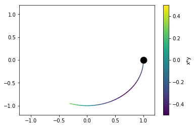

# Autofig Basics

``autofig`` aims to provide the following: 

* a unified calling structure to matplotlib's [plot](http://matplotlib.org/api/_as_gen/matplotlib.axes.Axes.plot.html), [scatter](http://matplotlib.org/api/_as_gen/matplotlib.axes.Axes.scatter.html), [errorbar](http://matplotlib.org/api/_as_gen/matplotlib.axes.Axes.errorbar.html), [LineCollection](http://matplotlib.org/gallery/shapes_and_collections/line_collection.html), and [PolyCollection](http://matplotlib.org/api/collections_api.html#matplotlib.collections.PolyCollection) in both 2D and 3D projections.  So if you decide you want to add errorbars or colorscaling to an existing plot call, you don't need to change the entire calling structure anymore.
* unified definition of sizes with multiple options, so resizing a figure doesn't require changing all markersizes/linewidths.
* basic "3D" support within 2D figures (by providing the z-coordinate, the z-orders will automatically be set)
* a high-level wrapper to animate an existing plot over some independent-variable (i.e. time), with effects including highlight and uncover.
* intelligent options for axes limits within animations.
* intelligent defaults for subplot creation based on conflicts in units/labels.


```python
import autofig
import numpy as np
import astropy.units as u
```

Here, depending on your version of Jupyter notebooks, you may need to set inline mode by uncommenting the line below so that the figures show in the notebook (if this doesn't work, you may also need to pass `show=True` to any `autofig.draw()` or `autofig.animate()` calls).  In a python script, omit this line, and sending `show=True` to `autofig.draw()` or `autofig.animate()` will popup an interactive matplotlib window.


```python
#autofig.inline()
```

``autofig`` allows building figures both with a top-down syntax (similar to calling plt.plot(...)) or with an object-oriented bottom-up syntax (similar to fig=plt.figure(); ax=fig.add_subplot(...); ax.plot(...)).  To get started, we'll use the top-down approach.

Using the top-down syntax there is really only one main call, autofig.plot.  This accepts arrays for each of 6 dimensions (optionally).  These dimensions are:
* x
* y
* z (will be used for z-order in 2D plots)
* i (the independent variable - either 'x', 'y', 'z' or its own array)
* c (color)
* s (size)

Let's start with a basic plot with just x and y data.


```python
x = np.linspace(0,10,101)
y = np.random.rand(101)
```


By using the top-down syntax and not creating any objects, ``autofig`` will continue to "append" to the existing figure.  In order to start over and clear the figure and all previous commands, we'll call ``autofig.reset``.  We'll later see other ways to get around this.  Passing `show=True` to the last `autofig.plot` call or calling `autofig.draw()` will plot and return the matplotlib figure instance.


```python
autofig.reset()
autofig.plot(x=x, y=y)
mplfig = autofig.draw()
```


By passing a float instead of an array, a vertical and/or horizontal is drawn:


```python
autofig.reset()
autofig.plot(x=x, y=y)
autofig.plot(x=4)
autofig.plot(x=8, y=0.7)
mplfig = autofig.draw()
```


## Labels and Units

In addition, each of the dimensions accept the following optional suffixes:
* unit (the units of the provided array, either string or astropy.units object)
* error (an array with same length as the values, not accepted for 'c' or 's')
* label


```python
autofig.reset()
autofig.plot(x=x, xlabel='time', xunit=u.s, y=y, ylabel='RV', yunit='km/s')
mplfig = autofig.draw()
```


Here we can see that the drawn label is actually the provided label AND the units.

## Styling (Markers and Lines)

``autofig.plot`` also accepts the following matplotlib keyword arguments:
* marker
* linestyle/ls

Note that markersize/ms and linewidth/lw are rejected with an error - these should be sent via the 's' dimension.  Similarly, color should be sent via the 'c' dimension.

In each of these cases, if both are provided, the fully spelled-out argument gets priority.


```python
autofig.reset()
autofig.plot(x=x, y=y, marker='s', ls='dashed')
mplfig = autofig.draw()
```


## Errorbars

Adding errorbars is as simple as providing an array to the error suffix for a given dimension.


```python
autofig.reset()
autofig.plot(x=x, y=y, yerror=y/2, marker='s', ls='dotted')
mplfig = autofig.draw()
```


## Color

Since 'c' is one of the dimensions, it accepts either an array or a string representing the color to pass on to matplotlib.  Note that it affects both the markers and the lines.  


```python
autofig.reset()
autofig.plot(x=x, y=y, c='red')
mplfig = autofig.draw()
```


If you want different color treatment for markers and lines you must do so with two separate calls to plot.


```python
autofig.reset()
autofig.plot(x=x, y=y, marker='None', ls='dotted', c='red')
autofig.plot(x=x, y=y, marker='s', ls='None', c='green')
mplfig = autofig.draw()
```


Now let's pass an array to the color dimension, as it is a dimension it also accepts label and unit.


```python
c = y**2

autofig.reset()
autofig.plot(x=x, y=y, 
             c=c, clabel='temp', cunit=u.K, cmap='afmhot')
mplfig = autofig.draw()
```


Colorscales and colorbars will be shared (per-axes) whenever there is no conflict between the 'c' dimension's label, units, and colormap.


```python
autofig.reset()
autofig.plot(x=x, y=y, c=c, clabel='temp', cunit=u.K, cmap='afmhot')
autofig.plot(x=x, y=y+1, c=2*c, clabel='temp', cunit=u.K, cmap='afmhot')
autofig.plot(x=x, y=y+2, c=3*c, clabel='other thing')
mplfig = autofig.draw()
```


## Size

Since 's' is also a dimension, it accepts either an array or float represent the markersizes and linewidths in units of the axes-size (i.e. 0.01 will takeup approximately 1% of the axes).  See the size-mode tutorial for more details and other available "modes" for size-scaling.


```python
autofig.reset()
autofig.plot(x=x, y=y, s=0.02)
mplfig = autofig.draw()
```


```python
s = np.sin(x*y)

autofig.reset()
autofig.plot(x=x, y=y,
             s=s, slabel='temp', sunit='K', 
             marker='s', ls='None')
mplfig = autofig.draw()
```


Similarly to cmap, when scaling by size you can pass a tuple to smap.  This tuple will give the lower and upper bounds of the point sizes that the entire range will be mapped onto.  By default this is (0.01,0.05), but if we want a smaller range of sizes, for example, we could do the following:


```python
s = np.sin(x*y)

autofig.reset()
autofig.plot(x=x, y=y,
             s=s, slabel='temp', sunit='K', smap=(0.01,0.1),
             marker='s', ls='None')
mplfig = autofig.draw()
```


We can also have the size dimension handle linewidths:


```python
s = np.sin(x)

autofig.reset()
autofig.plot(x=x, y=2*x,
             s=s, slabel='temp', sunit='K', smap=(0.001, 0.05),
             c='blue', marker='None', ls='solid')
mplfig = autofig.draw()
```


## Limits and Padding

As can be seen above, by default axes limits are set to encompass *all* of the data (ignoring the hidden data if uncover=True) and accounting for default padding.

See the limits tutorial for a full explanation of all the various options for limits and their influence on animations.

In short, limits can be passed directly to the plot command.  If multiple limits are passed to the same axes, the last value will take priority.


```python
autofig.reset()
autofig.plot(x=x, y=y, xlim=(0,20))
autofig.plot(x=x, y=y*2, xlim=(2, 7))
mplfig = autofig.draw()
```


When setting manual limits, padding is ignored.  However, we can also send a value for padding directly through the plot command.  As per-limits, the last value takes priority.

By default, padding is set to 10% for cartesian (x, y, z) dimensions and 0% for color and size.


```python
autofig.reset()
autofig.plot(x=x, y=y, xpad=0.5)
mplfig = autofig.draw()
```


Limits and padding are available for each of the dimensions (except 'i').  However, in addition to the single dimensions, there are a few "groups" in which you can set multiple settings simultaneously:

* xy (xylim, xypad)
* xyz (xyzlim, xyzpad)
* cs (*all currently-existing colorscales*; cslim, cspad)
* ss (*all currently-existing sizescales*; sslim, sspad)

Be careful if passing values to both a group and a single dimension - the order to which they are applied may be random.  For example, avoid passing xlim and xylim in the same call.


```python
autofig.reset()
autofig.plot(x=x, y=y, xypad=0.5)
mplfig = autofig.draw()
```


```python
autofig.reset()
autofig.plot(x=x, y=y, c=c, cpad=0.5)
mplfig = autofig.draw()
```


```python
autofig.reset()
autofig.plot(x=x, y=y, c=c, clabel='temp', cunit=u.K, cmap='afmhot')
autofig.plot(x=x, y=y+2, c=3*c, clabel='other thing', cmap='cool', cslim=(0,3))
mplfig = autofig.draw()
```


## Z-Order

The 'z-order' at which the plotting calls are drawn from back-to-front are according to their z-dimensions.  If a single value is given for z, that will be applied to all points, otherwise the z-order is determined on a per-point basis.

For any z not provided, that call's z-order will default to z=-infinity.  All plots with z=-infinity will then be drawn in the order they were called.


```python
autofig.reset()
autofig.plot(x=x, y=y, z=10, c='red', marker='o', linestyle='none')
autofig.plot(x=x, y=y, z=5, c='blue', marker='o', linestyle='none')
mplfig = autofig.draw()
```


```python
autofig.reset()
autofig.plot(x=x, y=y, z=5, c='red', marker='o', linestyle='none')
autofig.plot(x=x, y=y, z=10, c='blue', marker='o', linestyle='none')
mplfig = autofig.draw()
```


```python
autofig.reset()
autofig.plot(x=x, y=y, z=y, c='red', marker='o', linestyle='none')
autofig.plot(x=x, y=y, z=-4+10*y, c='blue', marker='o', linestyle='none')
mplfig = autofig.draw()
```


**NOTE**: when any given segment of a line is small, using a linestyle other than 'solid' is hard to see.


```python
autofig.reset()
autofig.plot(x=x, y=2*x, linestyle='dashed', marker='none')
mplfig = autofig.draw()
```


```python
autofig.reset()
autofig.plot(x=x, y=2*x, z=2*x, linestyle='dashed', marker='none')
mplfig = autofig.draw()
```


**NOTE**: the z-order of each segment of the line is determined based on the point to the left.  In the future interpolation within the segment may be supported (but then non-solid lines will never show).  We can see this below.  The first case blue changes its order wrt red throughout the plot, whereas in the second case blue is always below red because the entire segment is getting its zorder from the left point.


```python
autofig.reset()
autofig.plot(x=x, y=y, z=x, linestyle='solid', marker='none', color='r', s=0.08)
autofig.plot(x=x, y=0*y+0.5, z=-5+2*x, linestyle='solid', marker='none', color='b', s=0.08)
mplfig = autofig.draw()
```


```python
autofig.reset()
inds = [0, -1]
autofig.plot(x=x, y=y, z=x, 
             linestyle='solid', marker='none', 
             color='r', s=0.08)
autofig.plot(x=x[inds], y=0*y[inds]+0.5, z=-5+2*x[inds], 
             linestyle='solid', marker='none', 
             color='b', s=0.08)
mplfig = autofig.draw()
```


## Aspect Ratio

By default, if both x and y dimensions are of the same physical type, then equal aspect ratio will be used.  To override this default, you can set 'equal_aspect' to True or False.

If axes limits are not explicity provided, then the axes limits will be adjusted to pad.  If axes limits are explicitly provided, then the size of the axes itself will be adjusted to maintain an equal aspect ratio.  To override this default, you can set 'pad_aspect' to True or False.


```python
autofig.reset()
autofig.plot(x=x, y=y)
mplfig = autofig.draw()
```


```python
autofig.reset()
autofig.plot(x=x, y=y, equal_aspect=True)
mplfig = autofig.draw()
```


```python
autofig.reset()
autofig.plot(x=x, y=y, equal_aspect=True, xlim=(0,10), ylim=(-1,3))
mplfig = autofig.draw()
```


```python
autofig.reset()
autofig.plot(x=x, y=y, equal_aspect=True, pad_aspect=True, xlim=(0,10), ylim=(-1,3))
mplfig = autofig.draw()
```


**NOTE:** this means that 'km' vs 'm' will have an equal aspect ratio, but currently ignores the unit itself.  This behavior may be changed in the future.


```python
autofig.reset()
autofig.plot(x=x, y=y, xunit='m', yunit='km')
mplfig = autofig.draw()
```


## Property Cycler

As you may have noticed, `autofig` attempts to set reasonable defaults for all properties (color, linestyle, marker, etc) when no value is provided (or None is sent).

Sending None to linestyle or marker will fallback on the defaults (provided by the property cycler), whereas the strings 'None' or 'none' will result in no line or marker drawn, respectively.


```python
autofig.reset()
autofig.plot(x=x, y=y, linestyle=None)
mplfig = autofig.draw()
```


```python
autofig.reset()
autofig.plot(x=x, y=y, linestyle='None')
mplfig = autofig.draw()
```


When multiple calls are made, Nones are replaced with the next available entry from the cycler, which is handled on a per-axes (not per-figure) basis.


```python
autofig.reset()
autofig.plot(x=x, y=y, marker='None')
autofig.plot(x=x, y=0.1*x, marker='None')
mplfig = autofig.draw()
```


In the case above, where no color or linestyle were provided for either call to plot, both followed the order of their respective cyclers (black -> blue for color and solid -> dashed for linestyle).

If we set the color on the first call to be red, the second will default to black since it is unused.


```python
autofig.reset()
autofig.plot(x=x, y=y, marker='None', c='red')
autofig.plot(x=x, y=0.1*x, marker='None')
mplfig = autofig.draw()
```


And lastly, by setting the second to black the first will need to change to the second color in the cycler.  Note that it originally starts as black, but since the color is set to None, it will change when the second call is added.


```python
autofig.reset()
autofig.plot(x=x, y=y, marker='None')
mplfig = autofig.draw()
```


```python
autofig.plot(x=x, y=0.1*x, marker='None', color='k')
mplfig = autofig.draw()
```

## Independent Variable

By defining the independent variable, we can draw our figure at a given value of that variable.


```python
autofig.reset()
autofig.plot(x=x, y=y, i='x')
mplfig = autofig.draw(i=5)
```


Here we can see a blue dot drawn highlighting the value at i=5.

There are several available effects for the independent variable which accept the corresponding additional arguments:
* highlight (True/False)
  * highlight_marker (defaults to 'o')
  * highlight_color (defaults to color)
  * highlight_size (defaults to size)
  * highlight_linestyle (defaults to 'None')
* uncover (True/False)
* trail (True/False/float representing % in i)


```python
autofig.reset()
autofig.plot(x=x, y=y, i='x', 
             uncover=True,
             highlight=True, 
             highlight_color='b', 
             highlight_marker='s', 
             highlight_size=0.05, 
             highlight_linestyle='dashed')
mplfig = autofig.draw(i=5)
```


```python
autofig.reset()
autofig.plot(x=x, y=y, i='x', 
             uncover=True,
             highlight=True, 
             highlight_color='b', 
             highlight_marker='s', 
             highlight_size=0.05, 
             highlight_linestyle='dashed',
             trail=0.1)
mplfig = autofig.draw(i=5)
```


### Selecting on Independent Variable


```python
indeps = np.linspace(0,10,11)
xs = [np.linspace(0,10,11) for i in indeps]
ys = [np.random.rand(11) for i in indeps]
```


```python
autofig.reset()
autofig.plot(x=xs, y=ys, i=indeps)
mplfig = autofig.draw()
```


```python
autofig.reset()
autofig.plot(x=xs, y=ys, i=indeps)
mplfig = autofig.draw(i=3)
```


```python
autofig.reset()
autofig.plot(x=xs, y=ys, i=indeps, show=True, uncover=True)
mplfig = autofig.draw(i=3)
```


```python
autofig.reset()
autofig.plot(x=xs, y=ys, i=indeps, show=True, uncover=True, trail=0)
mplfig = autofig.draw(i=3)
```


### Sorting by Independent Variable


```python
order = [1,4,3,5,2,6]
t_indep = np.concatenate([np.linspace((i-1)*2*np.pi, i*2*np.pi, 100) for i in order])
x_indep = np.concatenate([np.linspace(0, 2*np.pi, 100) for i in order])
y_indep = np.cos(x_indep)+t_indep/5
```

When `i` is not provided, the plots will be drawn in the order of the arrays provided.


```python
autofig.reset()

autofig.plot(x_indep, y_indep, c=t_indep, marker='None')
mplfig = autofig.draw()
```


However, when providing `i`, the points will be re-sorted in increasing `i` (this is only really noticeable when linestyle is enabled)


```python
autofig.reset()
autofig.plot(x_indep, y_indep, i=t_indep, c=t_indep, marker='None')
mplfig = autofig.draw()
```


To avoid the line drawing when decreasing in `x`, pass linebreak='x-' (meaning the line won't be drawn whenever x is decreasing).  The value to linebreak can be None (don't break lines, which is the default), or '<direction><+/->' where direction is one of the dimensions in the call (i.e. x, y, z, i, c, s) followed by a '+' (for increasing) or '-' (for decreasing).


```python
autofig.reset()
autofig.plot(x_indep, y_indep, i=t_indep, c=t_indep, marker='None', linebreak='x-')
mplfig = autofig.draw()
```


## Animations

Creating an animation is as simple as calling ``animate`` instead of ``draw`` and passing a list of values to loop over for the independent variable (interpolation will be used, so they don't need to be a member of the original data array).


```python
autofig.reset()
autofig.plot(x=x, y=y, i='x', uncover=True, trail=0.3)
anim = autofig.animate(i=np.linspace(0,10,201),
                       save='basics_x.gif', save_kwargs={'writer': 'imagemagick'})
```


In some cases the independent variable may not be one of the plotted dimensions (time, for example).


```python
t = np.linspace(0, 2*np.pi, 101)
x = np.cos(t)
y = np.sin(t)
c = x*y

autofig.reset()
autofig.plot(x=x, y=y, i=t, c=c, clabel='x*y',
             marker='None', uncover=True, trail=0.3)
anim = autofig.animate(i=t, 
                       save='basics_i.gif', save_kwargs={'writer': 'imagemagick'})
```





## Subplots

When making calls to plot, ``autofig`` determines whether that call is consistent with any of the existing axes/subplots.  If not, it creates a new one and handles the subplot grid accordingly.

A plot is *inconsistent* with an existing axes if any of the following conditions is True:

* non-identical label in any *cartesian* or independent-variable (x,y,z,i) dimension (with None or omitted labels ignored)
* non-identical title (axes title) (with None or omitted titles ignored)
* inconsistent (different physical type) units in any *cartesian* or independent-variable (x,y,z,i) dimension (None or omitted is assumed to be unitless and can therefore cause inconsistency)

For more information on creating custom layouts see the [subplot/axes positioning documentation](subplot_positioning.md).


```python
autofig.reset()
autofig.plot(x=[1,2,3], xunit='s', xlabel='time',
             y=[1,2,3], yunit='km', ylabel='y',
             color='blue')
autofig.plot(x=[1,2,3], xunit='s',
             y=[2,3,4], yunit='km',
             color='red')
autofig.plot(x=[1,2,3], xunit='km', xlabel='x',
             y=[3,4,5], yunit='km', ylabel='y',
             color='green')
mplfig = autofig.draw()
```


```python

```
