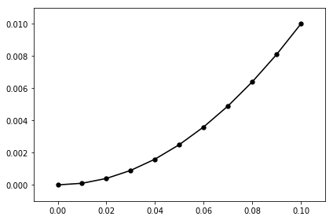
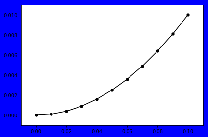
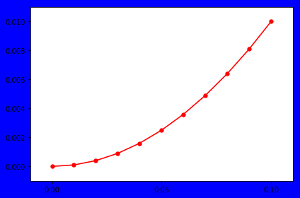

# Accessing the Matplotlib Objects


```python
import autofig
import numpy as np
import matplotlib.pyplot as plt
```


```python
#autofig.inline()
```


```python
x = np.linspace(0,0.1,11)
y = x**2
```


```python
mplfig = autofig.plot(x=x, y=y, show=True)
```





## matplotlib figure

When autofig completes a draw (either with autofig.draw() or passing show=True to a plot or mesh call), a matplotlib figure instance object is returned.  You can then act on this with anything supported by your version of matplotlib (see the [matplotlib figure API docs](https://matplotlib.org/api/_as_gen/matplotlib.figure.Figure.html#matplotlib.figure.Figure))


```python
print dir(mplfig)
```

    ['_Figure__remove_ax', '__class__', '__delattr__', '__dict__', '__doc__', '__format__', '__getattribute__', '__getstate__', '__hash__', '__init__', '__module__', '__new__', '__reduce__', '__reduce_ex__', '__repr__', '__setattr__', '__setstate__', '__sizeof__', '__str__', '__subclasshook__', '__weakref__', '_af', '_af_callbacks', '_agg_filter', '_alpha', '_animated', '_axobservers', '_axstack', '_cachedRenderer', '_clipon', '_clippath', '_contains', '_dpi', '_gci', '_get_axes', '_get_dpi', '_gid', '_hold', '_label', '_make_key', '_mouseover', '_oid', '_path_effects', '_picker', '_prop_order', '_propobservers', '_rasterized', '_remove_method', '_repr_html_', '_set_artist_props', '_set_dpi', '_set_gc_clip', '_sketch', '_snap', '_stale', '_sticky_edges', '_suptitle', '_tight', '_tight_parameters', '_transform', '_transformSet', '_url', '_visible', 'add_axes', 'add_axobserver', 'add_callback', 'add_subplot', 'aname', 'artists', 'autofmt_xdate', 'axes', 'bbox', 'bbox_inches', 'callbacks', 'canvas', 'clear', 'clf', 'clipbox', 'colorbar', 'contains', 'convert_xunits', 'convert_yunits', 'delaxes', 'dpi', 'dpi_scale_trans', 'draw', 'draw_artist', 'eventson', 'figimage', 'figure', 'figurePatch', 'findobj', 'format_cursor_data', 'frameon', 'gca', 'get_agg_filter', 'get_alpha', 'get_animated', 'get_axes', 'get_children', 'get_clip_box', 'get_clip_on', 'get_clip_path', 'get_contains', 'get_cursor_data', 'get_default_bbox_extra_artists', 'get_dpi', 'get_edgecolor', 'get_facecolor', 'get_figheight', 'get_figure', 'get_figwidth', 'get_frameon', 'get_gid', 'get_label', 'get_path_effects', 'get_picker', 'get_rasterized', 'get_size_inches', 'get_sketch_params', 'get_snap', 'get_tight_layout', 'get_tightbbox', 'get_transform', 'get_transformed_clip_path_and_affine', 'get_url', 'get_visible', 'get_window_extent', 'get_zorder', 'ginput', 'have_units', 'hitlist', 'hold', 'images', 'is_figure_set', 'is_transform_set', 'legend', 'legends', 'lines', 'mouseover', 'number', 'patch', 'patches', 'pchanged', 'pick', 'pickable', 'properties', 'remove', 'remove_callback', 'savefig', 'sca', 'set', 'set_agg_filter', 'set_alpha', 'set_animated', 'set_canvas', 'set_clip_box', 'set_clip_on', 'set_clip_path', 'set_contains', 'set_dpi', 'set_edgecolor', 'set_facecolor', 'set_figheight', 'set_figure', 'set_figwidth', 'set_frameon', 'set_gid', 'set_label', 'set_path_effects', 'set_picker', 'set_rasterized', 'set_size_inches', 'set_sketch_params', 'set_snap', 'set_tight_layout', 'set_transform', 'set_url', 'set_visible', 'set_zorder', 'show', 'stale', 'stale_callback', 'sticky_edges', 'subplotpars', 'subplots', 'subplots_adjust', 'suppressComposite', 'suptitle', 'text', 'texts', 'tight_layout', 'transFigure', 'update', 'update_from', 'waitforbuttonpress', 'zorder']


```python
mplfig.set_facecolor('blue')
```


```python
mplfig
```





## matplotlib axes

Likewise, you can then access all the individiual matplotlib axes objects as children of this figure (see the [matplotlib axes API docs](https://matplotlib.org/api/axes_api.html#matplotlib.axes.Axes))


```python
mplfig.axes
```


    [<matplotlib.axes._subplots.AxesSubplot at 0x7fddb5316790>]


```python
mplax = mplfig.axes[0]
```


```python
print dir(mplax)
```

    ['__class__', '__delattr__', '__dict__', '__doc__', '__format__', '__getattribute__', '__getstate__', '__hash__', '__init__', '__module__', '__new__', '__reduce__', '__reduce_ex__', '__repr__', '__setattr__', '__setstate__', '__sizeof__', '__str__', '__subclasshook__', '__weakref__', '_add_text', '_adjustable', '_af', '_af_callbacks', '_agg_filter', '_alpha', '_anchor', '_animated', '_aspect', '_autoscaleXon', '_autoscaleYon', '_axes', u'_axes_class', '_axes_locator', '_axisbelow', '_cachedRenderer', '_clipon', '_clippath', '_connected', '_contains', '_current_image', '_facecolor', '_frameon', '_gci', '_gen_axes_patch', '_gen_axes_spines', '_get_axis_list', '_get_lines', '_get_patches_for_fill', '_get_view', '_gid', '_gridOn', '_hold', '_init_axis', '_label', '_left_title', '_make_twin_axes', '_mouseover', '_navigate', '_navigate_mode', '_oid', '_on_units_changed', '_originalPosition', '_path_effects', '_pcolorargs', '_picker', '_position', '_process_unit_info', '_prop_order', '_propobservers', '_quiver_units', '_rasterization_zorder', '_rasterized', '_remove_method', '_right_title', '_sci', '_set_artist_props', '_set_gc_clip', '_set_lim_and_transforms', '_set_view', '_set_view_from_bbox', '_shared_x_axes', '_shared_y_axes', '_sharex', '_sharey', '_sketch', '_snap', '_stale', '_sticky_edges', '_subplotspec', '_tight', '_transform', '_transformSet', '_update_line_limits', '_update_patch_limits', '_update_transScale', '_url', '_use_sticky_edges', '_validate_converted_limits', '_visible', '_xaxis_transform', '_xcid', '_xmargin', '_yaxis_transform', '_ycid', '_ymargin', 'acorr', 'add_artist', 'add_callback', 'add_collection', 'add_container', 'add_image', 'add_line', 'add_patch', 'add_table', 'aname', 'angle_spectrum', 'annotate', 'apply_aspect', 'arrow', 'artists', 'autoscale', 'autoscale_view', 'axes', 'axesPatch', 'axhline', 'axhspan', 'axis', 'axison', 'axvline', 'axvspan', 'bar', 'barbs', 'barh', 'bbox', 'boxplot', 'broken_barh', 'bxp', 'callbacks', 'can_pan', 'can_zoom', 'change_geometry', 'cla', 'clabel', 'clear', 'clipbox', 'cohere', 'colNum', 'collections', 'containers', 'contains', 'contains_point', 'contour', 'contourf', 'convert_xunits', 'convert_yunits', 'csd', 'dataLim', 'drag_pan', 'draw', 'draw_artist', 'end_pan', 'errorbar', 'eventplot', 'eventson', 'figbox', 'figure', 'fill', 'fill_between', 'fill_betweenx', 'findobj', 'fmt_xdata', 'fmt_ydata', 'format_coord', 'format_cursor_data', 'format_xdata', 'format_ydata', 'get_adjustable', 'get_agg_filter', 'get_alpha', 'get_anchor', 'get_animated', 'get_aspect', 'get_autoscale_on', 'get_autoscalex_on', 'get_autoscaley_on', 'get_axes_locator', 'get_axis_bgcolor', 'get_axisbelow', 'get_children', 'get_clip_box', 'get_clip_on', 'get_clip_path', 'get_contains', 'get_cursor_data', 'get_cursor_props', 'get_data_ratio', 'get_data_ratio_log', 'get_default_bbox_extra_artists', 'get_facecolor', 'get_fc', 'get_figure', 'get_frame_on', 'get_geometry', 'get_gid', 'get_images', 'get_label', 'get_legend', 'get_legend_handles_labels', 'get_lines', 'get_navigate', 'get_navigate_mode', 'get_path_effects', 'get_picker', 'get_position', 'get_rasterization_zorder', 'get_rasterized', 'get_renderer_cache', 'get_shared_x_axes', 'get_shared_y_axes', 'get_sketch_params', 'get_snap', 'get_subplotspec', 'get_tightbbox', 'get_title', 'get_transform', 'get_transformed_clip_path_and_affine', 'get_url', 'get_visible', 'get_window_extent', 'get_xaxis', 'get_xaxis_text1_transform', 'get_xaxis_text2_transform', 'get_xaxis_transform', 'get_xbound', 'get_xgridlines', 'get_xlabel', 'get_xlim', 'get_xmajorticklabels', 'get_xminorticklabels', 'get_xscale', 'get_xticklabels', 'get_xticklines', 'get_xticks', 'get_yaxis', 'get_yaxis_text1_transform', 'get_yaxis_text2_transform', 'get_yaxis_transform', 'get_ybound', 'get_ygridlines', 'get_ylabel', 'get_ylim', 'get_ymajorticklabels', 'get_yminorticklabels', 'get_yscale', 'get_yticklabels', 'get_yticklines', 'get_yticks', 'get_zorder', 'grid', 'has_data', 'have_units', 'hexbin', 'hist', 'hist2d', 'hitlist', 'hlines', 'hold', 'ignore_existing_data_limits', 'images', 'imshow', 'in_axes', 'invert_xaxis', 'invert_yaxis', 'is_figure_set', 'is_first_col', 'is_first_row', 'is_last_col', 'is_last_row', 'is_transform_set', 'ishold', 'label_outer', 'legend', 'legend_', 'lines', 'locator_params', 'loglog', 'magnitude_spectrum', 'margins', 'matshow', 'minorticks_off', 'minorticks_on', 'mouseover', 'mouseover_set', 'name', 'numCols', 'numRows', 'patch', 'patches', 'pchanged', 'pcolor', 'pcolorfast', 'pcolormesh', 'phase_spectrum', 'pick', 'pickable', 'pie', 'plot', 'plot_date', 'properties', 'psd', 'quiver', 'quiverkey', 'redraw_in_frame', 'relim', 'remove', 'remove_callback', 'reset_position', 'rowNum', 'scatter', 'semilogx', 'semilogy', 'set', 'set_adjustable', 'set_agg_filter', 'set_alpha', 'set_anchor', 'set_animated', 'set_aspect', 'set_autoscale_on', 'set_autoscalex_on', 'set_autoscaley_on', 'set_axes_locator', 'set_axis_bgcolor', 'set_axis_off', 'set_axis_on', 'set_axisbelow', 'set_clip_box', 'set_clip_on', 'set_clip_path', 'set_color_cycle', 'set_contains', 'set_cursor_props', 'set_facecolor', 'set_fc', 'set_figure', 'set_frame_on', 'set_gid', 'set_label', 'set_navigate', 'set_navigate_mode', 'set_path_effects', 'set_picker', 'set_position', 'set_prop_cycle', 'set_rasterization_zorder', 'set_rasterized', 'set_sketch_params', 'set_snap', 'set_subplotspec', 'set_title', 'set_transform', 'set_url', 'set_visible', 'set_xbound', 'set_xlabel', 'set_xlim', 'set_xmargin', 'set_xscale', 'set_xticklabels', 'set_xticks', 'set_ybound', 'set_ylabel', 'set_ylim', 'set_ymargin', 'set_yscale', 'set_yticklabels', 'set_yticks', 'set_zorder', 'specgram', 'spines', 'spy', 'stackplot', 'stale', 'stale_callback', 'start_pan', 'stem', 'step', 'sticky_edges', 'streamplot', 'table', 'tables', 'text', 'texts', 'tick_params', 'ticklabel_format', 'title', 'titleOffsetTrans', 'transAxes', 'transData', 'transLimits', 'transScale', 'tricontour', 'tricontourf', 'tripcolor', 'triplot', 'twinx', 'twiny', 'update', 'update_datalim', 'update_datalim_bounds', 'update_datalim_numerix', 'update_from', 'update_params', 'use_sticky_edges', 'viewLim', 'violin', 'violinplot', 'vlines', 'xaxis', 'xaxis_date', 'xaxis_inverted', 'xcorr', 'yaxis', 'yaxis_date', 'yaxis_inverted', 'zorder']


```python
mplax.set_xticks([0, 0.05, 0.1])
```


    [<matplotlib.axis.XTick at 0x7fdddb32ecd0>,
     <matplotlib.axis.XTick at 0x7fddb5265690>,
     <matplotlib.axis.XTick at 0x7fddb52280d0>]


```python
mplfig
```


## matplotlib artists

And from the axes (or directly from the figure) you can access the individual artists (lines, points, etc).


```python
mplax.get_lines()
```


    <a list of 1 Line2D objects>


```python
line = mplax.get_lines()[0]
```


```python
print dir(line)
```

    ['__class__', '__delattr__', '__dict__', '__doc__', '__format__', '__getattribute__', '__getstate__', '__hash__', '__init__', '__module__', '__new__', '__reduce__', '__reduce_ex__', '__repr__', '__setattr__', '__sizeof__', '__str__', '__subclasshook__', '__weakref__', '_af', '_af_callbacks', '_af_sizes', '_af_update_size_draw_complete', '_agg_filter', '_alpha', '_animated', '_antialiased', '_axes', '_clipon', '_clippath', '_color', '_contains', '_dashOffset', '_dashSeq', '_dashcapstyle', '_dashjoinstyle', '_drawStyles_l', '_drawStyles_s', '_drawstyle', '_get_markerfacecolor', '_get_rgba_face', '_get_rgba_ln_color', '_get_transformed_path', '_gid', '_invalidx', '_invalidy', '_is_sorted', '_label', '_lineStyles', '_linestyle', '_linestyles', '_linewidth', '_marker', '_markeredgecolor', '_markeredgewidth', '_markerfacecolor', '_markerfacecoloralt', '_markersize', '_markevery', '_mouseover', '_oid', '_path', '_path_effects', '_picker', '_prop_order', '_propobservers', '_rasterized', '_remove_method', '_set_gc_clip', '_sketch', '_snap', '_solidcapstyle', '_solidjoinstyle', '_split_drawstyle_linestyle', '_stale', '_sticky_edges', '_subslice', '_transform', '_transformSet', '_transform_path', '_transformed_path', '_url', '_us_dashOffset', '_us_dashSeq', '_visible', '_x', '_x_filled', '_xcid', '_xorig', '_xy', '_y', '_ycid', '_yorig', 'add_callback', 'aname', 'axes', 'clipbox', 'contains', 'convert_xunits', 'convert_yunits', 'draw', 'drawStyleKeys', 'drawStyles', 'eventson', 'figure', 'fillStyles', 'filled_markers', 'findobj', 'format_cursor_data', 'get_aa', 'get_agg_filter', 'get_alpha', 'get_animated', 'get_antialiased', 'get_c', 'get_children', 'get_clip_box', 'get_clip_on', 'get_clip_path', 'get_color', 'get_contains', 'get_cursor_data', 'get_dash_capstyle', 'get_dash_joinstyle', 'get_data', 'get_drawstyle', 'get_figure', 'get_fillstyle', 'get_gid', 'get_label', 'get_linestyle', 'get_linewidth', 'get_ls', 'get_lw', 'get_marker', 'get_markeredgecolor', 'get_markeredgewidth', 'get_markerfacecolor', 'get_markerfacecoloralt', 'get_markersize', 'get_markevery', 'get_mec', 'get_mew', 'get_mfc', 'get_mfcalt', 'get_ms', 'get_path', 'get_path_effects', 'get_picker', 'get_pickradius', 'get_rasterized', 'get_sketch_params', 'get_snap', 'get_solid_capstyle', 'get_solid_joinstyle', 'get_transform', 'get_transformed_clip_path_and_affine', 'get_url', 'get_visible', 'get_window_extent', 'get_xdata', 'get_xydata', 'get_ydata', 'get_zorder', 'have_units', 'hitlist', 'ind_offset', 'is_dashed', 'is_figure_set', 'is_transform_set', 'lineStyles', 'markers', 'mouseover', 'pchanged', 'pick', 'pickable', 'pickradius', 'properties', 'recache', 'recache_always', 'remove', 'remove_callback', 'set', 'set_aa', 'set_agg_filter', 'set_alpha', 'set_animated', 'set_antialiased', 'set_c', 'set_clip_box', 'set_clip_on', 'set_clip_path', 'set_color', 'set_contains', 'set_dash_capstyle', 'set_dash_joinstyle', 'set_dashes', 'set_data', 'set_drawstyle', 'set_figure', 'set_fillstyle', 'set_gid', 'set_label', 'set_linestyle', 'set_linewidth', 'set_ls', 'set_lw', 'set_marker', 'set_markeredgecolor', 'set_markeredgewidth', 'set_markerfacecolor', 'set_markerfacecoloralt', 'set_markersize', 'set_markevery', 'set_mec', 'set_mew', 'set_mfc', 'set_mfcalt', 'set_ms', 'set_path_effects', 'set_picker', 'set_pickradius', 'set_rasterized', 'set_sketch_params', 'set_snap', 'set_solid_capstyle', 'set_solid_joinstyle', 'set_transform', 'set_url', 'set_visible', 'set_xdata', 'set_ydata', 'set_zorder', 'stale', 'stale_callback', 'sticky_edges', 'update', 'update_from', 'validCap', 'validJoin', 'verticalOffset', 'zorder']


```python
line.set_color('red')
```


```python
mplfig
```





```python

```
