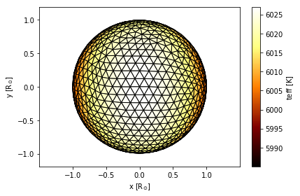

# Autofig Mesh


```python
import autofig
import numpy as np
import phoebe # PHOEBE 2.1 used for this demonstration
```


```python
#autofig.inline()
```

Let's generate a mesh in PHOEBE


```python
b = phoebe.default_binary()
b.add_dataset('mesh', times=[0], columns=['teffs', 'vws'])
b.run_compute()
```


    <ParameterSet: 10 parameters | components: primary, secondary>


```python
verts = b.get_value(qualifier='uvw_elements', component='primary', context='model')
print(verts.shape) # [polygon, vertex, dimension]
```

    (1738, 3, 3)


```python
teffs = b.get_value(qualifier='teffs', component='primary', context='model')
print(teffs.shape) # [polygon]
```

    (1738,)


```python
vzs = b.get_value(qualifier='vws', component='primary', context='model')
print(vzs.shape) # [polygon]
```

    (1738,)


```python
xs = verts[:, :, 0]
ys = verts[:, :, 1]
zs = verts[:, :, 2]
print(xs.shape, ys.shape, zs.shape)  # [polygon, vertex]
```

    ((1738, 3), (1738, 3), (1738, 3))


Meshes can be drawn by calling the `mesh` (instead of `plot`) method of a figure.  Most syntax and features are identical between the two, with the following exceptions:
* NO 'c' or 's' dimensions
* ADDITION of 'fc' (facecolor) and 'ec' (edgecolor) dimensions
* linestyle applies to the edges
* NO highlight
* uncover DEFAULTS to True
* trail DEFAULTS to 0
* NO marker
* NO linebreak

If 'z' is passed, the polygons will automatically be sorted in the order of positive z.  It is therefore suggested to pass 'z' for any 3D meshes even if plotting in 2D.

The edgecolor will default to 'black' and the facecolor to 'none' if not provided:


```python
autofig.reset()
autofig.mesh(x=xs, y=ys, z=zs, 
             xlabel='x', xunit='solRad', 
             ylabel='y', yunit='solRad')
mplfig = autofig.draw()
```


As was the case for dimensions in `plot`, 'fc' (facecolor) and 'ec' (edgecolor) accept the following suffixes:
* label
* unit
* map
* lim


```python
autofig.reset()
autofig.mesh(x=xs, y=ys, z=zs, 
             xlabel='x', xunit='solRad', 
             ylabel='y', yunit='solRad',
             fc=teffs, fcmap='afmhot', fclabel='teff', fcunit='K')
mplfig = autofig.draw()
```





The edges can be turned off by passing ec='none'.  Also see how fclim='symmetric' will force the white in the 'bwr' colormap to correspond to vz=0.


```python
autofig.reset()
autofig.mesh(x=xs, y=ys, z=zs,
             xlabel='x', xunit='solRad', 
             ylabel='y', yunit='solRad',
             fc=-vzs, fcmap='bwr', fclim='symmetric', fclabel='rv', fcunit='solRad/d', 
             ec='none')
mplfig = autofig.draw()
```


The facecolor default to 'none' allows you to see "through" the mesh:


```python
autofig.reset()
autofig.mesh(x=xs, y=ys, z=zs,
             xlabel='x', xunit='solRad', 
             ylabel='y', yunit='solRad',
             ec=-vzs, ecmap='bwr', eclim='symmetric', eclabel='rv', ecunit='solRad/d')
mplfig = autofig.draw()
```


In order to not see through the mesh, set the facecolor to 'white':


```python
autofig.reset()
autofig.mesh(x=xs, y=ys, z=zs,
             xlabel='x', xunit='solRad', 
             ylabel='y', yunit='solRad',
             ec=-vzs, ecmap='bwr', eclim='symmetric', eclabel='rv', ecunit='solRad/d', 
             fc='white')
mplfig = autofig.draw()
```


We can of course provide different arrays and colormaps for the edge and face:


```python
autofig.reset()
autofig.mesh(x=xs, y=ys, z=zs, 
             xlabel='x', xunit='solRad', 
             ylabel='y', yunit='solRad',
             fc=teffs, fcmap='afmhot', fclabel='teff', fcunit='K',
             ec=-vzs, ecmap='bwr', eclim='symmetric', eclabel='rv', ecunit='solRad/d')
mplfig = autofig.draw()
```


## Animate and Limits


```python
times = np.linspace(0,1,21)
b = phoebe.default_binary()
b.add_dataset('mesh', times=times, columns='vws')
b.run_compute()
```


    <ParameterSet: 128 parameters | components: primary, secondary>


Rather than add an extra dimension, we can make a separate call to `mesh` for each time and pass the time to the 'i' dimension as a float.


```python
autofig.reset()
for t in times:
    for c in ['primary', 'secondary']:
        verts = b.get_value(time=t, component=c, qualifier='uvw_elements', context='model')
        vzs = b.get_value(time=t, component=c, qualifier='vws', context='model')
        xs = verts[:, :, 0]
        ys = verts[:, :, 1]
        zs = verts[:, :, 2]
        autofig.mesh(x=xs, y=ys, z=zs, i=t,
                     xlabel='x', xunit='solRad', 
                     ylabel='y', yunit='solRad',
                     fc=-vzs, fcmap='bwr', fclim='symmetric', fclabel='rv', fcunit='solRad/d', 
                     ec='none',
                     consider_for_limits=c=='primary')
    
mplfig = autofig.draw()
```


```python
autofig.gcf().axes[0].pad_aspect=False  # pad_aspect=True (default) causes issues with fixed limits... sigh
anim = autofig.animate(i=times, save='mesh_1.gif', save_kwargs={'writer': 'imagemagick'})
```


```python
autofig.gcf().axes[0].x.lim = None
anim = autofig.animate(i=times, save='mesh_2.gif', save_kwargs={'writer': 'imagemagick'})
```


```python
autofig.gcf().axes[0].x.lim = 4
anim = autofig.animate(i=times, save='mesh_3.gif', save_kwargs={'writer': 'imagemagick'})
```


```python

```
