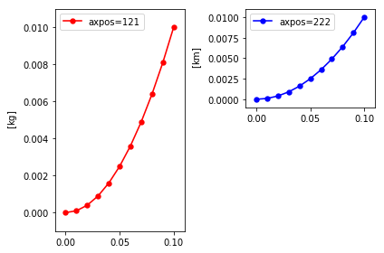
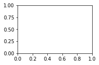

# Saving & Loading


```python
import autofig
import numpy as np
```


```python
#autofig.inline()
```


```python
x = np.linspace(0,0.1,11)
y = x**2
```


```python
autofig.reset()
autofig.plot(x, y, yunit='km', c='blue', axpos=222, label='axpos=222', legend=True)
autofig.plot(x, y, yunit='kg', c='red', axpos=(1,2,1), label='axpos=121', legend=True)
mplfig = autofig.draw(save_afig='saving_and_loading.afig')
```





```python
autofig.reset()
```


```python
autofig.open('saving_and_loading.afig')
```


    <autofig.figure.Figure | 2 axes | 2 call(s)>


```python
autofig.gcf().axes[1].y.get_lim()
```


    ---------------------------------------------------------------------------

    UnitConversionError                       Traceback (most recent call last)

    <ipython-input-29-dabdf116cf69> in <module>()
    ----> 1 autofig.gcf().axes[1].y.get_lim()
    

    /home/kyle/.local/lib/python2.7/site-packages/autofig-1.0.0-py2.7.egg/autofig/axes.pyc in get_lim(self, pad, i)
       1653                 if kind=='fixed':
       1654                     error = cd.get_error(None, unit=self.unit, linebreak=False, sort_by_indep=False)
    -> 1655                     array = cd.get_value(None, unit=self.unit, linebreak=False, sort_by_indep=False)
       1656                 elif kind=='frame':
       1657                     error = cd.get_error(i, unit=self.unit, linebreak=False, sort_by_indep=False)


    /home/kyle/.local/lib/python2.7/site-packages/autofig-1.0.0-py2.7.egg/autofig/call.pyc in get_value(self, i, unit, uncover, trail, linebreak, sort_by_indep, exclude_back, attr)
       2323         if i is None:
       2324             if len(value.shape)==1:
    -> 2325                 return self._to_unit(value, unit)
       2326             else:
       2327                 if isinstance(self.call, Plot):


    /home/kyle/.local/lib/python2.7/site-packages/autofig-1.0.0-py2.7.egg/autofig/call.pyc in _to_unit(self, value, unit)
       2045         if unit is not None:
       2046             unit = common._convert_unit(unit)
    -> 2047             value = value*self.unit.to(unit)
       2048 
       2049         return value


    /usr/local/lib/python2.7/dist-packages/astropy/units/core.pyc in to(self, other, value, equivalencies)
        977             If units are inconsistent
        978         """
    --> 979         return self._get_converter(other, equivalencies=equivalencies)(value)
        980 
        981     def in_units(self, other, value=1.0, equivalencies=[]):


    /usr/local/lib/python2.7/dist-packages/astropy/units/core.pyc in _get_converter(self, other, equivalencies)
        911                             pass
        912 
    --> 913             raise exc
        914 
        915     def _to(self, other):


    UnitConversionError: 'kg' (mass) and 'km' (length) are not convertible


```python
autofig.draw(show=True)
```


    ---------------------------------------------------------------------------

    TypeError                                 Traceback (most recent call last)

    <ipython-input-30-11f61ee8fd20> in <module>()
    ----> 1 autofig.draw(show=True)
    

    /home/kyle/.local/lib/python2.7/site-packages/autofig-1.0.0-py2.7.egg/autofig/__init__.pyc in draw(*args, **kwargs)
        138     * the return from <Figure.draw>
        139     """
    --> 140     return gcf().draw(*args, **kwargs)
        141 
        142 def animate(*args, **kwargs):


    /home/kyle/.local/lib/python2.7/site-packages/autofig-1.0.0-py2.7.egg/autofig/figure.pyc in draw(self, fig, i, calls, tight_layout, draw_sidebars, draw_title, subplot_grid, show, save, save_afig, in_animation)
        530                        draw_sidebars=False,
        531                        draw_title=draw_title,
    --> 532                        show=False, save=False, in_animation=in_animation)
        533 
        534             self._backend_artists += axesi._get_backend_artists()


    /home/kyle/.local/lib/python2.7/site-packages/autofig-1.0.0-py2.7.egg/autofig/axes.pyc in draw(self, ax, i, calls, draw_sidebars, draw_title, show, save, in_animation)
       1238 
       1239         xlim = self.x.get_lim(i=i)
    -> 1240         if not np.any(np.isnan(xlim)):
       1241             ax.set_xlim(xlim)
       1242         ylim = self.y.get_lim(i=i)


    TypeError: ufunc 'isnan' not supported for the input types, and the inputs could not be safely coerced to any supported types according to the casting rule ''safe''





```python

```
