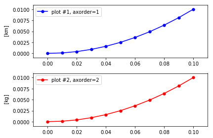
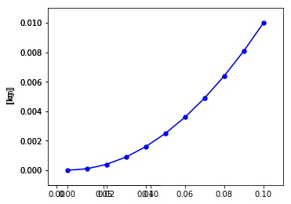

# Subplot/Axes Positioning


```python
import autofig
import numpy as np
import matplotlib.pyplot as plt
```


```python
#autofig.inline()
```


```python
x = np.linspace(0,0.1,11)
y = x**2
```

## Automatic/Default Behavior

Here we'll force two different axes/subplots by creating a conflict in the yunits.  By default, this will create two separate subplots stacked horizontally (three plots will then create a 2x2 grid, etc).


```python
autofig.reset()
autofig.plot(x, y, c='blue', yunit='km')
autofig.plot(x, y, c='red', yunit='kg')
mplfig = autofig.draw()
```


## Custom Grid (subplot_grid), Default Order/Position

To override the default grid (i.e. horizontal for the case of two subplots), you can pass a tuple (nrows, ncols) to the subplot_grid argument in draw.  These available subplots will then be filled in the order of increasing axorder (when provided) unless axpos is defined.


```python
autofig.reset()
autofig.plot(x, y, c='blue', yunit='km')
autofig.plot(x, y, c='red', yunit='kg')
mplfig = autofig.draw(subplot_grid=(1,2))
```


# Custom Order (axorder), Automatic Positioning

By default, autofig will place your axes in a somewhat random, unpredictable, order within the figure.


```python
autofig.reset()
autofig.plot(x, y, yunit='km', c='blue', axorder=2, label='plot #1', legend=True)
autofig.plot(x, y, yunit='kg', c='red', axorder=1, label='plot #2', legend=True)
mplfig = autofig.draw()
```


However, to force the order at which the grid is filled, you can pass an integer to axorder.  Here we'll force the plots to be drawn in the order they were called and then in reverse order.


```python
autofig.reset()
autofig.plot(x, y, yunit='km', c='blue', axorder=1, label='plot #1, axorder=1', legend=True)
autofig.plot(x, y, yunit='kg', c='red', axorder=2, label='plot #2, axorder=2', legend=True)
mplfig = autofig.draw()
```





```python
autofig.reset()
autofig.plot(x, y, yunit='km', c='blue', axorder=2, label='plot #1, axorder=2', legend=True)
autofig.plot(x, y, yunit='kg', c='red', axorder=1, label='plot #2, axorder=1', legend=True)
mplfig = autofig.draw()
```


This same logic works when overriding the default grid.


```python
autofig.reset()
autofig.plot(x, y, yunit='km', c='blue', axorder=1, label='plot #1, axorder=1', legend=True)
autofig.plot(x, y, yunit='kg', c='red', axorder=2, label='plot #2, axorder=2', legend=True)
mplfig = autofig.draw(subplot_grid=(1,2))
```


```python
autofig.reset()
autofig.plot(x, y, yunit='km', c='blue', axorder=2, label='plot #1, axorder=2', legend=True)
autofig.plot(x, y, yunit='kg', c='red', axorder=1, label='plot #2, axorder=1', legend=True)
mplfig = autofig.draw(subplot_grid=(1,2))
```


### Using axorder to force new axes

In these examples, we used different units to force the two plot calls into separate axes instances.  However, sometimes you have multiple calls with no conflicts but wish them to be placed in separate axes/subplots anyways.  To do so, you can force a conflict and provide the order they appear by providing different integers for axorder.


```python
autofig.reset()
autofig.plot(x, y, c='blue')
autofig.plot(x, y, c='red')
mplfig = autofig.draw()
```


```python
autofig.reset()
autofig.plot(x, y, c='blue', axorder=2)
autofig.plot(x, y, c='red', axorder=1)
mplfig = autofig.draw()
```


## Custom Positioning (axpos)

To set the custom positioning of an axes provide axpos as an int or tuple of three ints in the format of (nrows, ncols, index).


```python
autofig.reset()
autofig.plot(x, y, yunit='km', c='blue', axpos=222, label='axpos=222', legend=True)
autofig.plot(x, y, yunit='kg', c='red', axpos=(1,2,1), label='axpos=121', legend=True)
mplfig = autofig.draw()
```


## Custom Order (axorder) and Positioning (axpos)

In the cases where axpos is defined, axorder still defines the order at which they are drawn.  Therefore, if any of the subplots overlap, the axpos will define which are shown on top.

Note that any axes instances without axpos will still fill the available grid (or the one provided by subplot_grid) according to axorder.  Providing axpos for some, but not all, axes could result in unexpected and undesired results.  As a general rule, if you provide axpos for some axes, you should provide it for all of them.


```python
autofig.reset()
autofig.plot(x, y, yunit='km', c='blue', axpos=111, axorder=1)
autofig.plot(x, y, yunit='kg', c='red', axpos=121, axorder=2)
mplfig = autofig.draw()
```


```python
autofig.reset()
autofig.plot(x, y, yunit='km', c='blue', axpos=111, axorder=2)
autofig.plot(x, y, yunit='kg', c='red', axpos=121, axorder=1)
mplfig = autofig.draw()
```





```python

```
